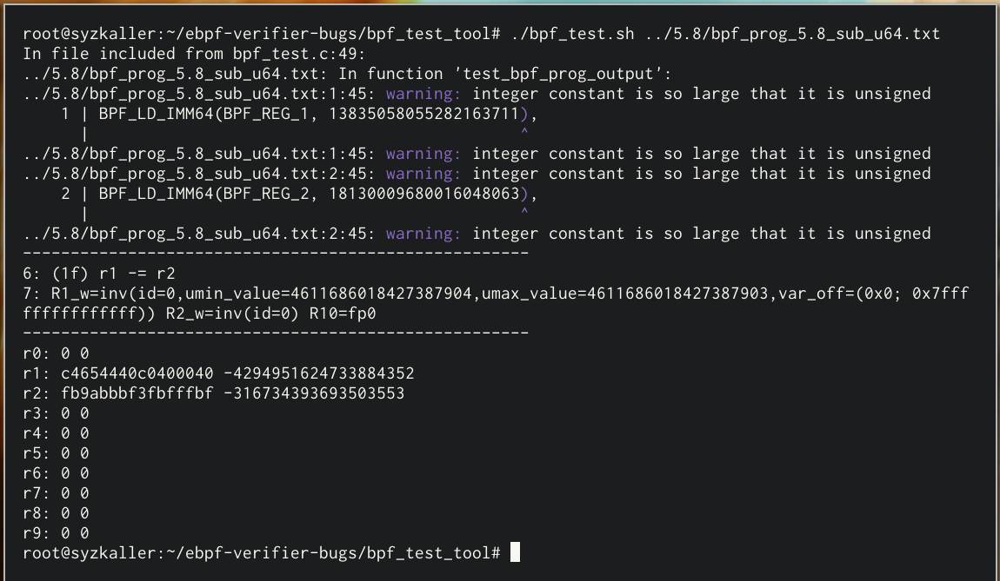

# ebpf-verifier-bugs
This repository is a collection of bugs in the eBPF verifier's range analysis discovered by our tool Agni ([CAV'23 research paper](https://people.cs.rutgers.edu/~sn624/papers/agni-cav23.pdf), [CAV'23 artifact](https://github.com/bpfverif/ebpf-range-analysis-verification-cav23)). Our tool produces several proof-of-concept (POC) eBPF programs that manifest the bugs found by static analysis of the eBPF verifier source code from the Linux kernel. Here, we demonstrate how to run the programs in Linux and witness the manifestation of the bug. 

## Structure of this repository

Each top level directory is a kernel version, and contains the POC eBPF programs (.txt) synthesized by Agni for the particular kernel version. Agni uses the following naming convention: `bpf_prog_<KernelVersion>_<Instruction>_<Domain>.txt`. For example, file titled `5.8_jlt_s64.txt` contains an eBPF program that manifests a bug in kernel version `5.8`, on the `jlt` (jump-less-than) instruction, and demonstrates a violation of the soundness in the `s64` (signed-64) abstract domain. In addition to eBPF instructions/macros, Agni also inserts some comments into the POC eBPF program: metadata useful for the `bpf_test_tool`. 

**bpf_test_tool.** The `bpf_test_tool` submodule contains scripts to quickly compile and run these examples in a Linux environment. It consists of a C wrapper around our POC eBPF programs that invokes the verifier. The script `bpf_test.sh` does the compilation, running, and printing out the verifier's log. Usually, the verifier log is very long; our script truncates this log to only the useful parts.

## Getting started
To get started, you will need to compile and run the kernel version for which you want to test the bugs. Skyzkaller has a quick [guide](https://github.com/google/syzkaller/blob/master/docs/linux/setup_ubuntu-host_qemu-vm_x86-64-kernel.md) to compile a custom kernel and run it in QEMU. The rest of this guide assumes you have Linux v5.8.0 (commit bcf87687) running. 


Our tool Agni has synthesized several POC eBPF programs (67 for kernel v5.8). All of these programs are present in the `5.8/` directory. Here, we demonstrate 3 of the verifier bugs found by Agni, and how to run them.

## Recreating verifier bugs

First clone this repository and the `bpf_test_tool` submodule.
```
git clone --recurse-submodules https://github.com/bpfverif/ebpf-verifier-bugs.git
```

Enter the `bpf_test_tool` directory
```
cd bpf_test_tool
```


### Example 1: An ALU instruction

Let's try to load the POC eBPF program `bpf_prog_5.8_sub_s64.txt`, which manifests a bug in the `BPF_SUB` instruction and in the `signed 64` abstract domain. The script `bpf_test.sh` is useful.

```
./bpf_test.sh ../5.8/bpf_prog_5.8_sub_s64.txt
```

This should produce the following output. 



**Reading the output.** The script only prints out lines `6` and `7` from the verifier log, omitting the other lines. (These "relevant" line numbers were inserted as comments into `bpf_prog_5.8_sub_s64.txt` by Agni.) Line `6` corresponds to the instruction involving the `BPF_SUB`: `r1 -= r2`. Line `7` consists of the verifier's beliefs in the values of the registers immediately after executing the instruction (more precisely, the abstract domain values used to track the values in the registers). Finallly, after the second set of dashed lines, the _actual_ values in 10 eBPF registers (`r0` through `r9`) are printed. 

**The bug.** Note that the filename `bpf_prog_5.8_sub_s64.txt` mentiones the abstract domain that this program violates soundness in: `s64`, so we have to look for `smin_value`, `smax_value` in the verifier log. However in this particular example, they are not printed. This is because the `print_verifier_log` function in `verifier.c` skips printing `smin_value` and `smax_value` if they are equal to `umin_value` and `umax_value` respectively. Knowing this, the error in the analysis of `SUB` in `signed 64` domain is clear: `smin_value` is greater than `smax_value`. This should never be the case in a sound analysis.

### Example 2: A JUMP instruction

```
./bpf_test.sh ../5.8/bpf_prog_5.8_jge_s32.txt
```


**Reading the output.** In case of a jump instruciton, the verifier tracks register values along both the true (go-to) and false (fall-through) paths. In this particular example, the verifier error takes place along the fall-through path. (Agni encodes this information as comments in `bpf_prog_5.8_jge_s32.txt`.) Our script prints only the relevant parts of the verifier log: instruction `6` (the JUMP instruction) and the verifier's beliefs about the values of the registers in the fall-through case. 

**The bug.** From the filename, `bpf_prog_5.8_jge_s32.txt` we know to look at the `signed 32` abstract domain in the verifier log: `s32_min_value` and `s32_max_value`. Register `R2`'s values are interesting: `s32_min_value=-2147483646,s32_max_value=-1`. Looking at the latter part of the output, the _actual_ value in register `R2` is `0x80000000252f502e`, i.e. `623857710` when interpreted as a signed 32-bit integer. It is clear that this number is not contained within the `signed 32` bounds. This is a bug in the verifier's analysis of `JGE`.

### Example 2: Another JUMP instruction

```
./bpf_test.sh ../5.8/bpf_prog_5.8_jlt_s64.txt
```


**Reading the output.** This time, our script prints out only the parts of the verifier log corresponding to the case of the branch instruction where the jump indeed occurs (which happens on line `9`).

**The bug.** Let's look at the `signed 64` domains of all the registers, `R2` in particular. We see that `smin_value=-9223372034707292160`, the minimum possible value in the register according to the verifier. But we also see that the _actual_ value in `R2` is `-9223372036720558079`, which is lesser than `smin_value`. Again, this is a bug in the verifier's analysis of `JLT`.

